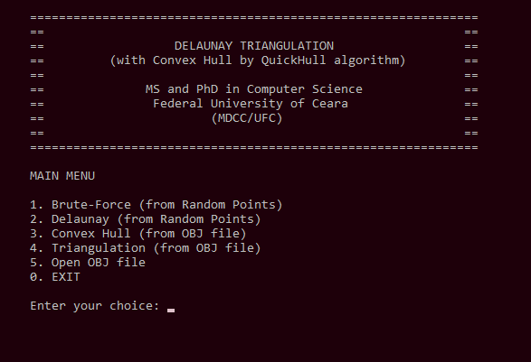
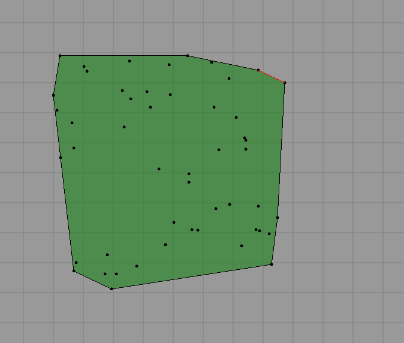
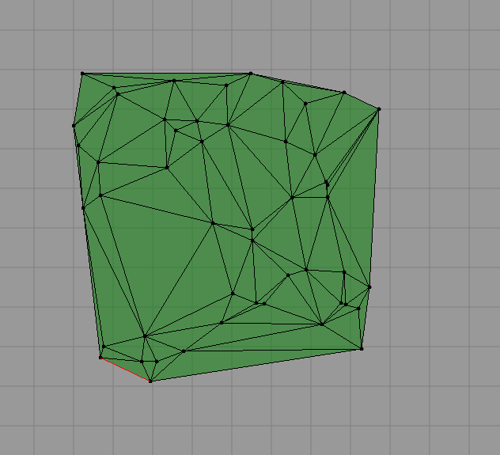

# Convex Hull and Delaunay Triangulation
2D Delaunay Triangulation with Convex Hull by QuickHull algorithm (MDCC/UFC) 2019.1
___
* Input file (*.obj):
```
# ICARO 2019 OBJ File
# icaro@lia.ufc.br
o Face1
v 50 400 0.00
v 50 50 0.00
v 400 50 0.00
v 400 400 0.00
# 4 vertices
l 1 2
l 1 3
l 3 2
l 1 4
l 4 3
# 5 lines
f 1 2 3 4
```
___
* Main menu  
  

___
* Convex Hull  
  

___
* Brute-Force triangulation  
  

___
* Delaunay triangulation  
  

